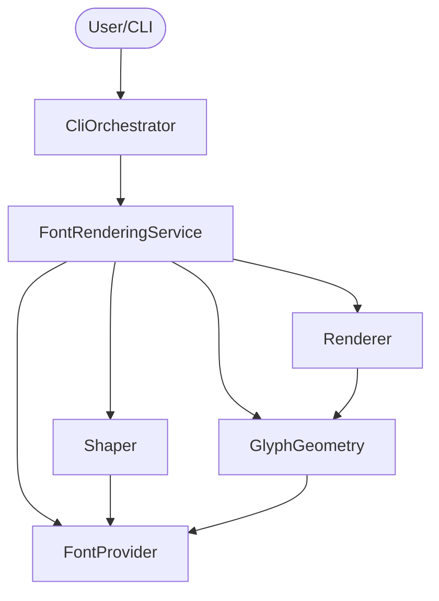

# Application Design - Consolidated

## 1. Overview
本システムは、Pure Zigで実装されたフォントレンダリングライブラリおよびCLIツールである。モジュール性を重視し、将来の拡張（他の画像形式への対応など）を容易にする設計を採用している。

## 2. Components & Responsibilities
- **FontProvider**: フォントファイルのバイナリパース。
- **Shaper**: 高度なテキストレイアウト（合字・カーニング等）。
- **GlyphGeometry**: グリフのアウトライン（幾何データ）抽出。
- **Renderer**: 最終出力（SVG）の生成。

## 3. Services & Orchestration
- **FontRenderingService**: ライブラリの主要エントリポイント。コンポーネント間の連携を管理。
- **CliOrchestrator**: CLIのユーザー入力とファイルI/Oの管理。

## 4. Design Decisions Recap
- **Memory Management**: 標準的な `Allocator` 受渡しモデルを採用。
- **Error Handling**: デバッグの容易性を高めるため、エラーコンテキストを含めた詳細な報告を行う。
- **Extensibility**: 現時点ではSVGに特化するが、コンポーネントが分割されているため、将来的な他形式への対応も容易。

## 5. Dependency Graph

