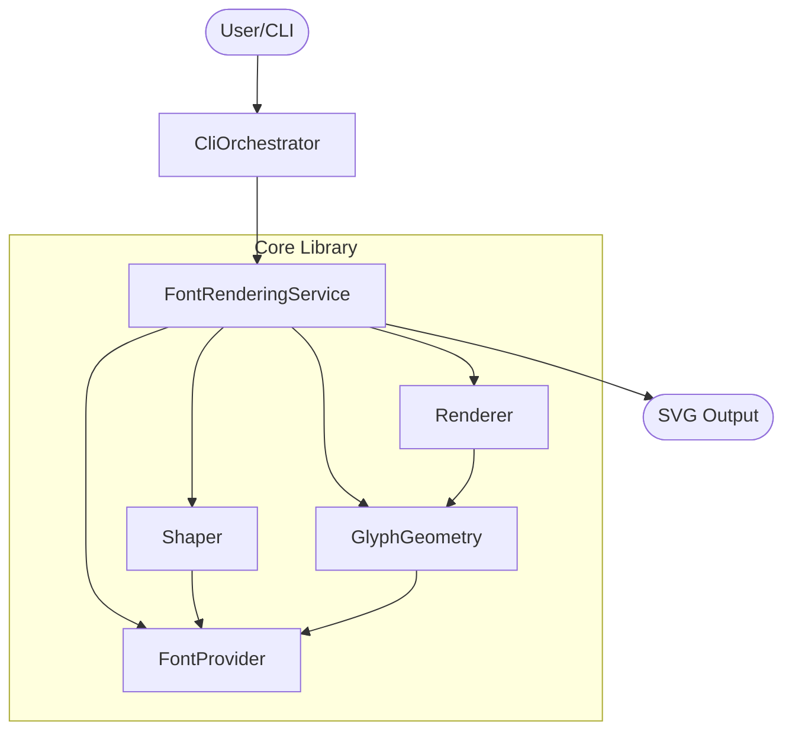

# Component Dependency

## Dependency Matrix
| Component | Depends On | Reason |
|---|---|---|
| `Shaper` | `FontProvider` | フォントテーブル（GSUB/GPOS）へのアクセス |
| `GlyphGeometry` | `FontProvider` | アウトラインデータ（glyf/CFF）へのアクセス |
| `Renderer` | `GlyphGeometry` | パスデータの取得 |
| `FontRenderingService` | 全て | オーケストレーション |
| `CliOrchestrator` | `FontRenderingService` | レンダリング実行 |

## Data Flow Diagram

## Communication Patterns
- **Call-and-Return**: 基本的に同期的な関数呼び出しで通信。
- **Memory Ownership**: `Allocator` を上位から下位へ渡し、下位で生成されたオブジェクトの寿命管理は呼び出し側（または `deinit` メソッド）が行う。
