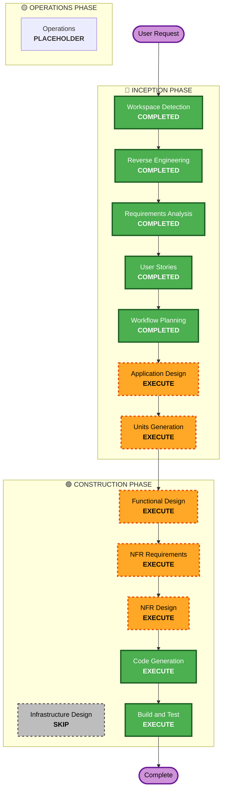

# Execution Plan

## Detailed Analysis Summary

### Transformation Scope (Brownfield Only)
- **Transformation Type**: Single component (Library/CLI)
- **Primary Changes**: Complete implementation of TrueType/OpenType parsing, shaping, and SVG rendering from a scaffold state.
- **Related Components**: `src/main.zig` (CLI), `src/root.zig` (Library module).

### Change Impact Assessment
- **User-facing changes**: Yes - New CLI tool functionality and new Library API.
- **Structural changes**: Yes - Addition of parsing, shaping, and rendering sub-modules within the core module.
- **Data model changes**: Yes - Font table structures, Glyph outlines, and Shaping state models.
- **API changes**: Yes - New public API for font loading and rendering.
- **NFR impact**: Yes - Performance focus for real-time rendering.

### Risk Assessment
- **Risk Level**: Medium (Implementation of complex font specifications in Pure Zig is error-prone but isolated).
- **Rollback Complexity**: Easy (Git based, no persistent database state).
- **Testing Complexity**: Moderate (Requires visual verification and comparison with reference renderers).

## Workflow Visualization

## Phases to Execute

### 🔵 INCEPTION PHASE
- [x] Workspace Detection (COMPLETED)
- [x] Reverse Engineering (COMPLETED)
- [x] Requirements Analysis (COMPLETED)
- [x] User Stories (COMPLETED)
- [x] Workflow Planning (IN PROGRESS)
- [ ] Application Design - EXECUTE
  - **Rationale**: Need to define the internal module structure (Parser, Shaper, Renderer) and their interfaces.
- [ ] Units Generation - EXECUTE
  - **Rationale**: The project should be broken down into units (e.g., Font Parsing Unit, Shaping Unit, SVG Rendering Unit).

### 🟢 CONSTRUCTION PHASE
- [ ] Functional Design - EXECUTE
  - **Rationale**: Detailed design for font table parsing and shaping algorithms is critical.
- [ ] NFR Requirements - EXECUTE
  - **Rationale**: Pure Zig performance and real-time rendering constraints need formal assessment.
- [ ] NFR Design - EXECUTE
  - **Rationale**: Designing for performance (SIMD, allocation strategies) is necessary for real-time goals.
- [ ] Infrastructure Design - SKIP
  - **Rationale**: No cloud/web infrastructure; it's a local library/CLI.
- [ ] Code Generation - EXECUTE (ALWAYS)
  - **Rationale**: Implementation of the font renderer.
- [ ] Build and Test - EXECUTE (ALWAYS)
  - **Rationale**: Comprehensive testing is required for font rendering accuracy.

## Estimated Timeline
- **Total Phases**: 8 more stages (Inception 2, Construction 6)
- **Estimated Duration**: ~2-3 days of development effort.

## Success Criteria
- **Primary Goal**: Render complex text (Latin/JP) to SVG using Pure Zig.
- **Key Deliverables**:
    - Pure Zig TTF/OTF Parser.
    - GSUB/GPOS Shaping Engine.
    - SVG Outline Renderer.
    - CLI Tool.
