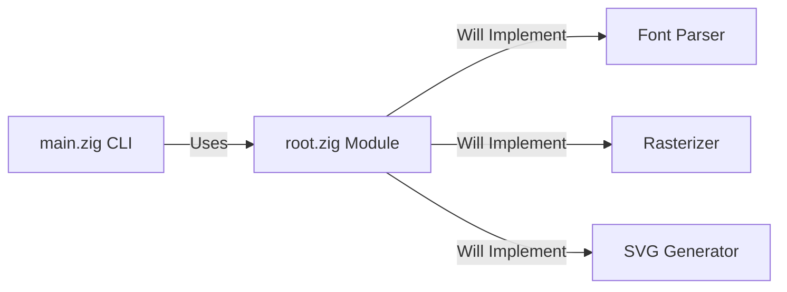
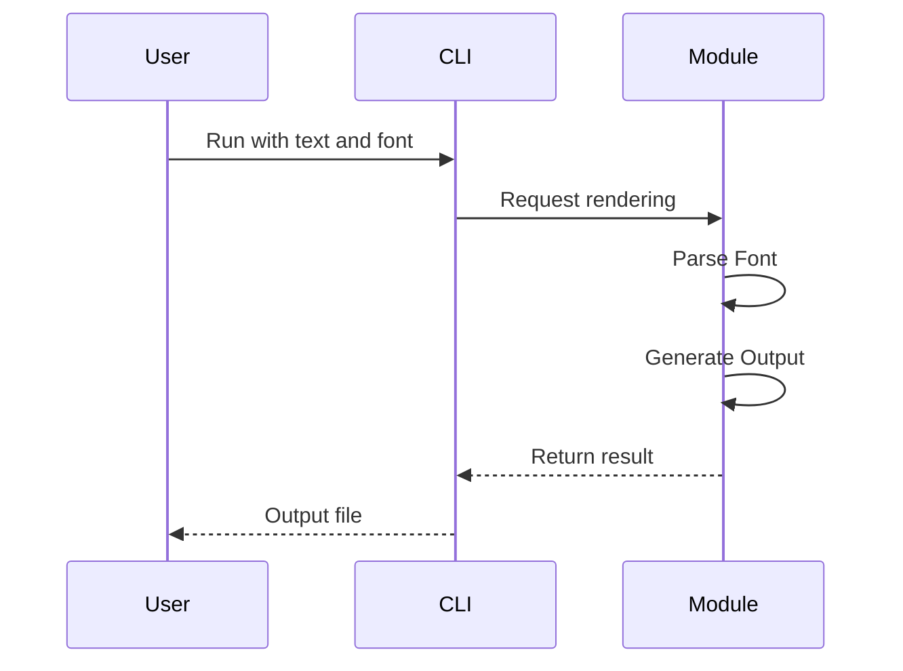

# System Architecture

## System Overview
The system is a command-line application and a library written in Zig. It aims to provide font rendering capabilities.

## Architecture Diagram

## Component Descriptions
### zig_font_renderer (Executable)
- **Purpose**: CLI entry point.
- **Responsibilities**: Command-line argument parsing and orchestration.
- **Dependencies**: zig_font_renderer (Module)
- **Type**: Application

### zig_font_renderer (Module)
- **Purpose**: Core library.
- **Responsibilities**: Font processing and rendering logic.
- **Dependencies**: standard library
- **Type**: Library

## Data Flow

## Integration Points
- **External APIs**: None currently.
- **Databases**: None.
- **Third-party Services**: None.

## Infrastructure Components
- **Deployment Model**: Native executable.
