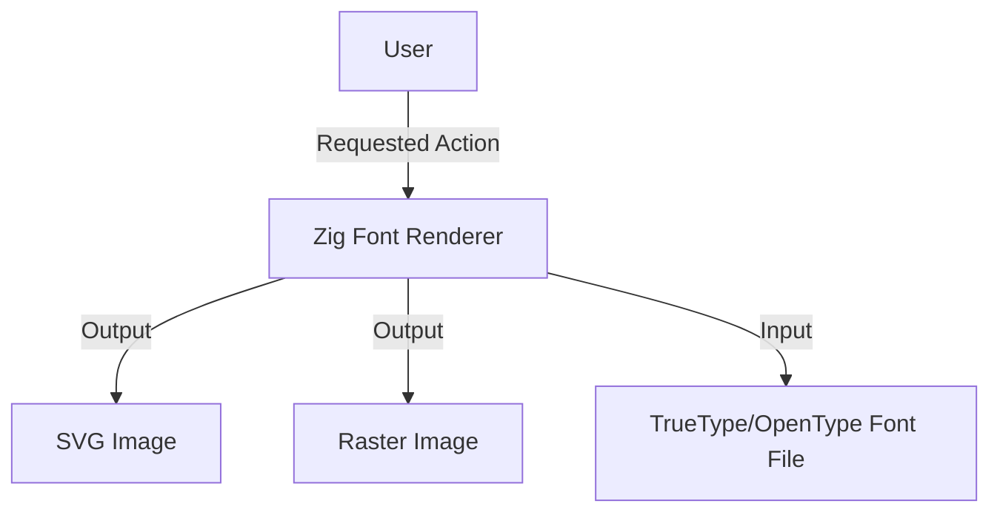

# Business Overview

## Business Context Diagram

## Business Description
- **Business Description**: A font rendering system written in Zig that converts text and font files into visual representations (SVG or images).
- **Business Transactions**:
    - **Render Text to SVG**: Convert a given string and font file into an SVG path.
    - **Render Text to Image**: Convert a given string and font file into a raster image (e.g., PNG).
- **Business Dictionary**:
    - **Glyph**: A specific graphical representation of a character.
    - **TrueType/OpenType**: Common font file formats.
    - **SVG**: Scalable Vector Graphics, an XML-based vector image format.

## Component Level Business Descriptions
### zig_font_renderer (Core Module)
- **Purpose**: Provides the core logic for font parsing and rendering.
- **Responsibilities**:
    - Parsing TrueType/OpenType font files.
    - Shaping text (converting characters to glyph indices and positions).
    - Rasterizing glyphs or generating vector paths.
