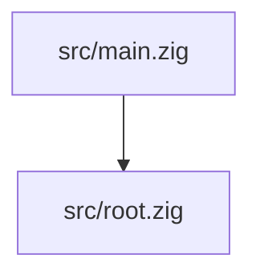

# Code Structure

## Build System
- **Type**: Zig Build System
- **Configuration**: `build.zig` and `build.zig.zon`

## Key Classes/Modules

### Existing Files Inventory
- `build.zig` - Build configuration for the project.
- `build.zig.zon` - Package metadata and dependencies.
- `src/main.zig` - Executable entry point.
- `src/root.zig` - Library module root.

## Design Patterns
No specific patterns implemented yet beyond the standard Zig library/executable split.

## Critical Dependencies
### Zig Standard Library
- **Version**: 0.15.2
- **Usage**: Throughout the project.
- **Purpose**: Core functionality.
